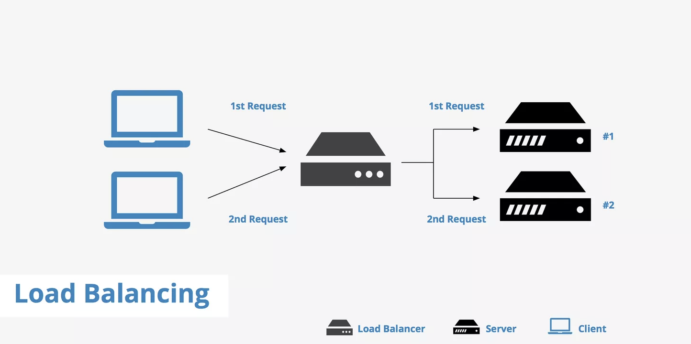
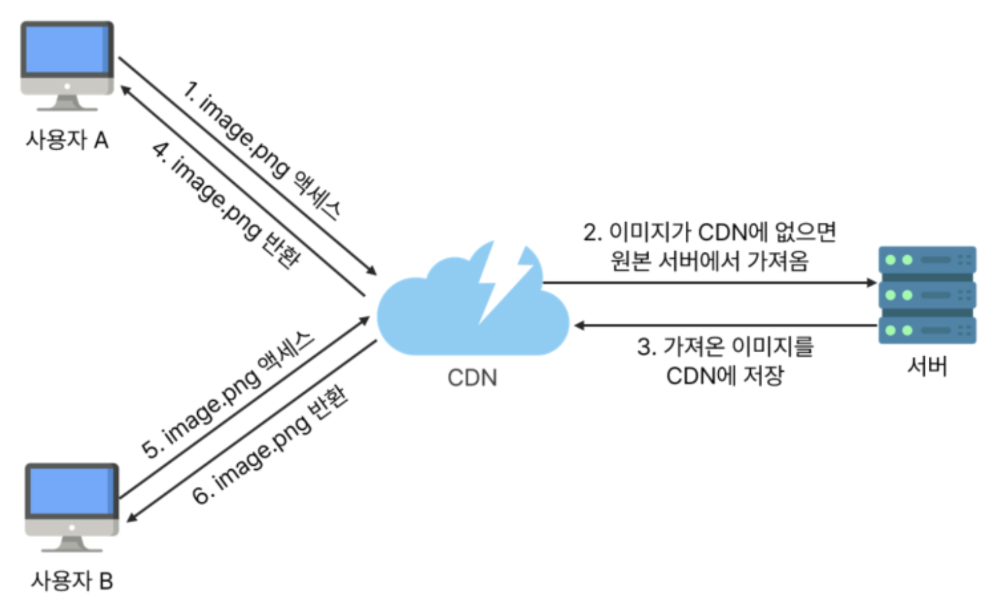
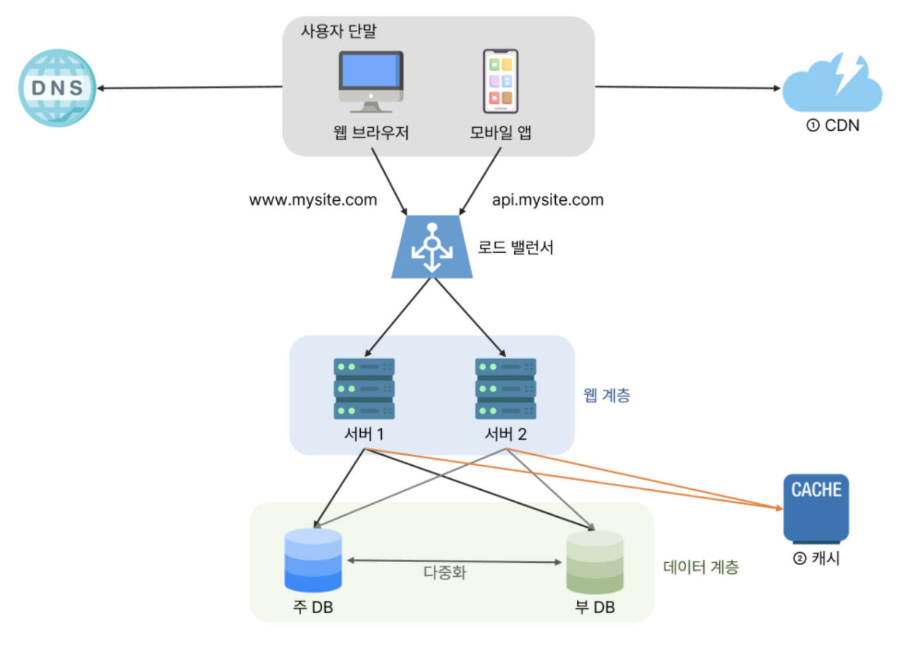
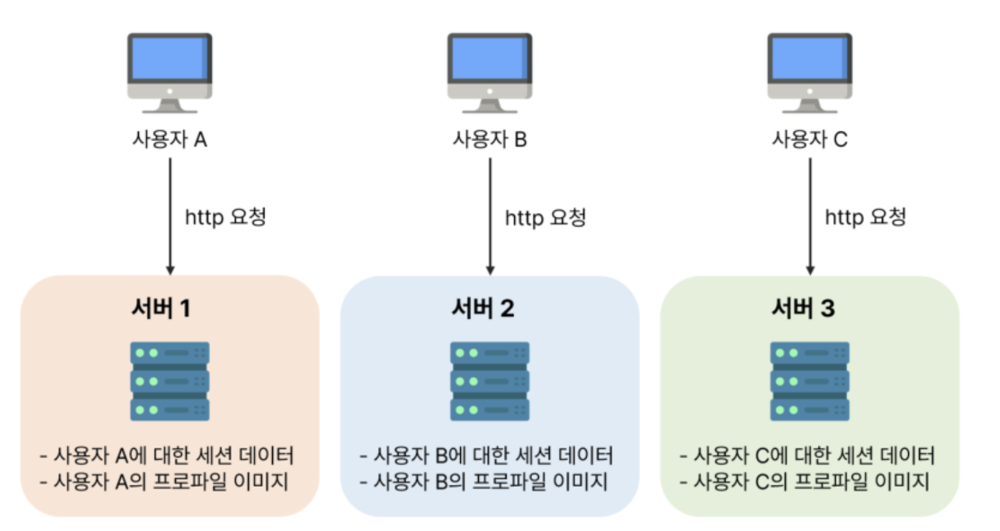
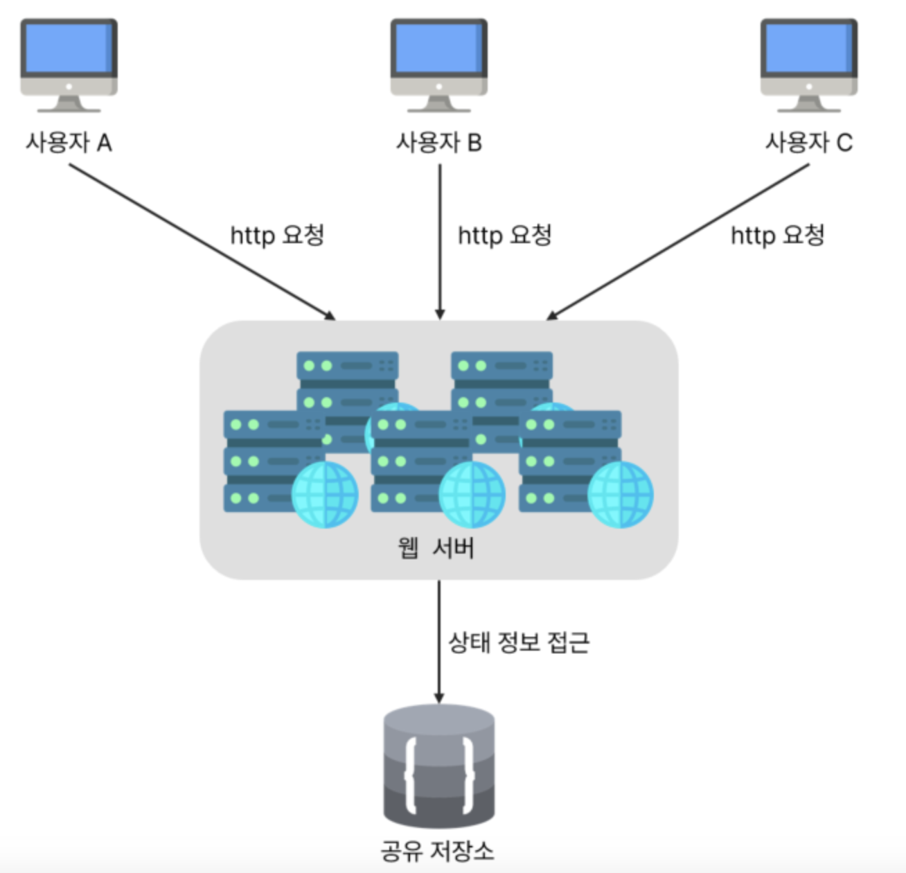
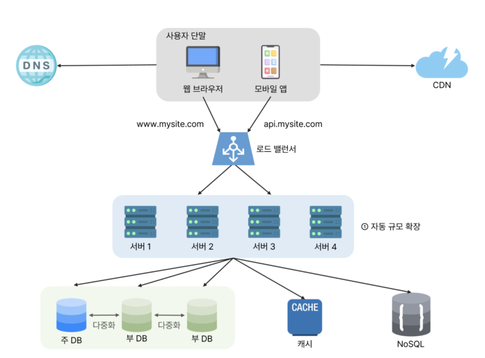
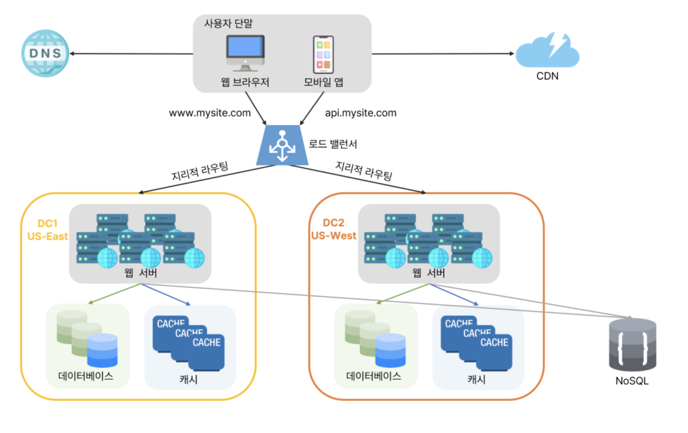
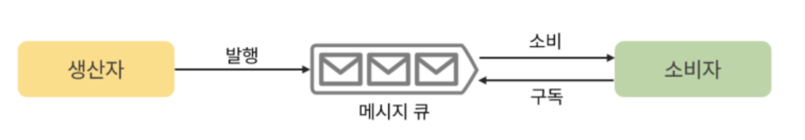
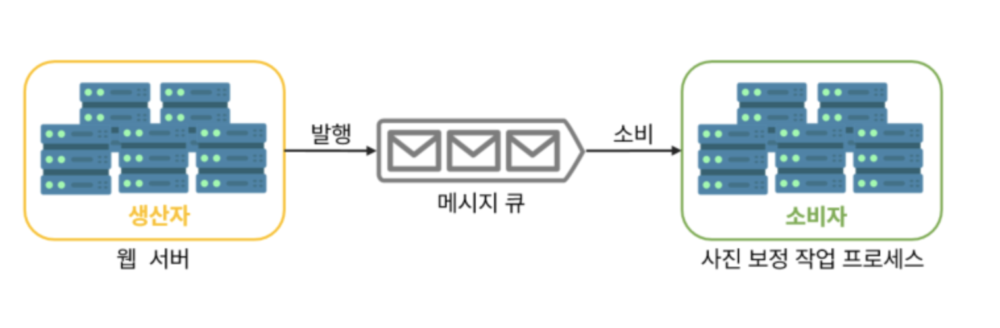

# 1장, 사용자 수에 따른 규모 확장성

* 한명의 사용자를 지원하는 시스템에서 시작하여, 최종적으로 몇백만 사용자를 지원하는 시스템을 설계
* 규모 확장성과 관계된 설계문제를 푸는데 유용한 지식들

### 단일 서버
모든 컴포넌트가 한대의 서버에서 실행되는 간단한 시스템 설계
웹 앱, 데이터베이스, 캐시 등이 전부 서버 한대에서 실행된다.

### 데이터베이스
사용자가 늘면 서버 하나로는 충분하지 않아 여러 서버를 두어야한다. 
하나는 웹/모바일 트래픽용도, 다른 하나는 데이터 베이스 용이다.  
웹/모바일 트래픽 처리 서버(웹계층)과 데이터베이스 서버(데이터 계층)를 분리하면 각각 독립적으로 확장해 나갈수 있다.  
*비-관계형 데이터베이스가 바람직한 경우*
* 아주 낮은 응답지연시간(latency)요구
* 다루는 데이터가 비정형이라 관계형 데이터가 아님
* 데이터(json, xml등)를 직렬화 하거나 역직렬화 할 수 있기만 하면됨
* 아주 많은 양의 데이터를 저장할 필요가 있음

> **어떤 데이터 베이스를 사용할 것인가?**
>  * 관계형 데이터베이스
>   * 자료를 row, column으로 표현
>   * sql을 사용하여 여러 테이블에 있는 데이터를 join할수 있다.
>   * ACID (원자성, 일관성, 고립성, 지속성) 트랜잭션을 지원하여 데이터 일관성과 안정성을 보장
>   * 
> * 비 관계형 데이터 베이스
>   * 키-값 저장소, 그래프 저장소 등으로 표현
>   * 일반적으로 join연산을 지원하지 않는다.
>   * ACID 트랜잭션을 일반적으로 지원하지 않는다. 
>   * NoSQL은 스키마 없거나 유연한 스키마를 허용하며, 비구조화 데이터를 저장하는 데 적합
  

---  

### 수직적 규모확장 vs 수평적 규모확장
소위 스케일업 이라고 하는 수직적 규모확장은 서버에 고사양 자원을 추가하는 행위를 말한다.  
반면, 스케일 아웃 이라고 하는 수평적 규모 확장 프로세스는 더 많은 서버를 추가하여 성능을  개선하는 행위를 말한다.  
**서버로 유입되는 트래픽의 양이 적을때는 수직정확장**이 좋은 선택이며, 이방법의 가장 큰 장점은 단순함이다.   
단점 : 
* 수직적 규모확장에 한계가 있다. 한대의 서버에 cpu나 메모리를 무한대로 증설할 방법은 없다.
* 수직적 규모확장법은 장애에 대한 자동복구 방안이나 다중화 방안을 제시하지 않는다.
* 서버에 장애가 발생하면 웹사이트/앱은 완전히 중단된다. 

앞서 본 설계에서 사용자는 웹서버에 바로 연결된다. 웹 서버가 다운되면 사용자는 웹 사이트에 접속할수 없다.  
또한 너무 많은 사용자가 접속해 서버가 한계 상황에 도달하게 되면 응답속도가 느려지거나 서버 접속이 불가능해 질수 도있다.
이런 문제를 해결하는 데는 부하 분산기 또는 로드 밸런서를 도입하는 것이 최선이다. 
#### 로드밸런서
로드 밸런서는 부하 분산 집합에 속한 웹 서버들에게 트래픽 부하를 고르게 분산하는 역할을 한다.
  
Client는 로드 밸런서의 공개 IP주소(Public IP)로 접속한다. 따라서 웹 서버는 클라이언트의 접속을 집적 처리하지 않는다.  
더 나은 보안을 위해, 서버 간 통신에는 사설 IP(Private IP)가 이용된다. 
> Private IP란?  
> 같은 네트워크에 속한 서버 사이의 통신에만 쓰일 수 있는 IP주소로, 인터넷을 통해서 접속할 수 ㅇ벗다.
> 로드 밸런서는 웹 서버와 통신하기 위해 Private IP를 이용한다.

#### 데이터베이스 다중화
많은 데이터 베이스 관리 시스템이 다중화를 지원한다.  
보통은 서버 사이에 master(주)-slave(부)관계를 설정하고 데이터 원본은 주 서버에 사본은 부 서버에 저장하는 방식이다.  
쓰기연산은 마스터에서만 지원한다. 부 데이터 베이스는 마스터로부터 사본을 전달받으며, 읽기 연산만을 지원한다.   
데이터를 변경하는 연산 명령어들은 마스터 데이터 베이스로만 전달되어야한다. 대부분의 애플리케이션은 읽기 연산의 비중이 쓰기 연산보다. 훨씬 높다.  
통상 부 데이터 베이스의 수가 주 데이터베이스의 수보다 많다.  
다중화의 장점
* 더 나은 성능: 마스터-슬레이브 모델에서 읽기 연산을 병렬로 처리하여 성능 향상
* 안정성: 데이터를 지역적으로 떨어진 여러장소에 다중화 시켜 놓을 수 있다.
* 가용성: 데이터를 복제함으로써 하나의 데이터베이스 서버에 장애가 발생하더라도 다른 서버의 데이터를 가져와 서비스할수 있다.

---

### 캐시
캐시는 값비싼 연산 결과 또는 자주 참조되는 데이터를 메모리 안에 두고, 뒤 이은 요청이 보다 빨리 처리 될 수 있도록 하는 저장소다.  
애플리케이션의 성능은 데이터 베이스를 얼마나 자주 호출하느냐에 크게 좌우되는데, 캐시는 그런 문제를 완화할 수 있다.
#### 캐시계층
캐시 계층은 데이터가 잠시 보관되는 곳으로 데이터베이스보다 훨씬 빠르다. 별도의 캐시 계층을 두면 성능이 개선될 뿐만 아니라 데이터 베이스의 부하를 줄일 수 있고,
캐시 계층의 규모를 독립적으로 확장 시키는것도 가능해진다.  
* 읽기 주도형 캐시전략
1. 만일 데이터가 캐시에 있으면 캐시에서 데이터를 읽음
2. 데이터가 캐시에 없으면 데이터베이스에서 해당 데이터를 읽어 캐시에 씀
3. 웹서버에 데이터 반환

위 전략 외에도 다양한 캐시 전략이 있는데, 캐시할 데이터의 종류,크기, 액세스 패턴에 맞는 캐시전략을 선택하면된다.  

#### 캐시사용시 유의할점
* 캐시는 데이터 갱신은 자주 일어나지 않지만 참조는 빈번하게 일어난다면 고려해볼 만하다.
* 어떤 데이터를 캐시에 두어야하는가?
  * 캐시는 데이터를 휘발성 메모리에 두므로 영속적으로 보관할 데이터를 캐시에 두는 것은 바람직 하지 않다. 
* 캐시에 보관된 데이터는 어떤게 만료되는가?
  * 이에 대한 정책을 마련해두는 것은 좋은 습관이다. 만료 기한이 없으면 데이터는 캐시에 계속 남게된다. 너무 짧으면 데이터베이스를 자주 읽게된다.
* 일관성은 어떻게 유지되는가?
  * 일관성은 데이터 저장소의 원본과 캐시 내의 사본이 같은지 여부이다. 저장소의 원본을 갱신하는 연산과 캐시를 갱신하는 연산이 단일 트랜잭션으로 처리되지 않는 경우 이 일관성은 깨질 수 있다.
* 장애에는 어떻게 대처할 것인가?
  * 캐시 서버를 한대만 두는 경우 해당 서버는 단일 장애 지점(Single Point Of Failure)이 되어버릴 가능성이 있다. 이것을 피하려면 여러 지역에 걸쳐 캐시서버를 분산시켜야한다. 
* 캐시 메모리는 얼마나 크게 잡을 것인가?
  * 캐시 메모리가 너무 작으면 액세스 패턴에 따라서 데이터가 캐시에서 밀려나버려(eviction) 캐시의 성능이 떨어지게된다. 이를 막을 방법 중 하나는 캐시 메모리를 과할당 하는것이다. 이렇게 하면 캐시에 보관될 데이터가 갑자기 늘어 났을떄 생길 문제도 방지할 수 있게한다. 
* 데이터 방출(eviction)정책은 무엇인가?
  * 캐시가 꽉 차버리면 추가로 캐시에 데이터를 넣어야할 경우 기존 데이터를 내보내야한다. 이것을 캐시데이터 바ㅇ출 정책이라고한다.
  * LRU (Least Recentlry Used) - 마지막으로 사용된 시점이 가장 오래된 데이터를 내보내는 정책
  * LFU (Least Frequently Used) - 사용된 빈도가 가장 낮은 데이터를 내보내는 정책

---
### 콘텐츠 전송 네트워크 (CDN)
CDN은 정적 콘텐츠를 전송하는데 쓰이는, 지리적으로 분산된 서버의 네트워크이다. 이미지, 비디오, CSS, JavaScript 파일등을 캐시할 수 있다.  
> CDN은 어떻게 동작하는지 개략적으로 살펴보자  
> 사용자가 웹사이트를 방문하면 사용자에게 가장 가까운 CDN서버가 정적 콘텐츠를 전달하게 된다.  
> 사용자가 CDN서버로 부터 멀면 멀수록 웹사이트는 천천히 로드될것이다. 
> ex) CDN 서버가 LA에 있다면, 유럽 사용자 보다 빠른 웹사이트를 보게 될것이다.

사용자 A가 이미지 URL을 이용해서 image.png에 접근한다.
URL의 도메인은 CDN 서비스 사업자가 제공한다.
아래의 두 URL은 클라우드프론트(CloudFront)와 아카마이(Akamai) CDN이 제공하는 URL의 예제이다.
https://mysite.cloudfront.net/logo.jpg
https://mysite.akamai.com/image-manager/img/logo.jpg
2. CDN 서버의 캐시에 해당 이미지가 없는 경우, 서버는 원본(origin) 서버에 요청하여 파일을 가져온다.
   원본 서버는 웹 서버일 수도 있고 아마존(Amazon) S3 같은 온라인 저장소일 수도 있다.
3. 원본 서버가 파일을 CDN 서버에 반환한다.
   응답의 HTTP 헤더에는 해당 파일이 얼마나 오래 캐시될 수 있는지를 설명하는 TTL(Time-To-Live) 값이 들어 있다.
4. CDN 서버는 파일을 캐시하고 사용자 A에게 반환한다.
   이미지는 TTL에 명시된 시간이 끝날 때까지 캐시된다.
5. 사용자 B가 같은 이미지에 대한 요청을 CDN 서버에 전송한다.
6. 만료되지 않은 이미지에 대한 요청은 캐시를 통해 처리된다.

**CDN 사용 시 고려해야 할 사항**
1. 비용  
   CDN은 보통 제3 사업자(third-party provides)에 의해 운영되며, 개발자는 CDN으로 들어가고 나가는 데이터 전송 양에 따라 요금을 내게 된다.
   자주 사용되지 않는 콘텐츠를 캐싱하는 것은 이득이 크지 않으므로, CDN에서 빼는 것을 고려하는 것이 좋다.
2. 적절한 만료 시한 설정  
   시의성이 중요한(time-sensitive) 콘텐츠의 경우 만료 시점을 잘 정해야 한다.
   너무 길면 콘텐츠의 신선도는 떨어진다.
   너무 짧으면 원본 서버에 빈번히 접속하게 되어서 좋지 않다.
3. CDN 장애에 대한 대처 방안  
   CDN 자체가 죽었을 경우 웹사이트/애플리케이션이 어떻게 동작해야 하는지 고려해야 한다.
   일시적으로 CDN이 응답하지 않을 경우, 해당 문제를 감지하여 원본 서버로부터 직접 콘텐츠를 가져오도록 클라이언트를 구성하는 것이 필요할 수도 있다.
4. 콘텐츠 무효화(invalidation) 방법  
   아직 만료되지 않은 콘텐츠라 하더라도 아래 방법 가운데 하나를 쓰면 CDN에서 제거할 수 있다.
   CDN 서비스 사업자가 제공하는 API를 이용하여 콘텐츠 무효화
   콘텐츠의 다른 버전을 서비스하도록 오브젝트 버저닝(object versioning) 이용. 콘텐츠의 새로운 버전을 지정하기 위해서는 URL 마지막에 버전 번호를 인자로 주면 된다. (Ex. image.png?v=2)

#### CDN과 캐시가 추가된 설계

---

### 무상태(stateless) 웹계층
상태 정보를 관계형 데이터베이스나 NoSQL 같은 지속성 저장소에 보관하고, 필요할 때 가져오도록 구성된 웹 계층을 무상태 웹 계층이라고 부른다.

#### 상태 정보 의존적인 아키텍처
상태 정보를 보관하는 서버는 클라이언트 정보, 즉 상태를 유지하여 요청들 사이에 공유되도록 한다.

사용자 A의 세션 정보나 프로파일 이미지 같은 상태 정보는 서버 1에 저장된다. 사용자 A를 인증하기 위해서 HTTP 요청은 반드시 서버 1로 전송되어야 한다. 서버 2에 사용자 A에 관한 데이터는 보관되어 있지 않기 때문에 요청이 서버 2로 전송되면 인증은 실패한다.

마찬가지로, 사용자 B로부터 HTTP 요청은 전부 서버 2로 전송되어야 하고, 사용자 C로부터의 요청은 전부 서버 3으로 전송되어야 한다.  
여기서 문제는 같은 클라이언트로부터의 요청은 항상 같은 서버로 전송 되어야한다는 것이다. 대부분의 로드밸런서가 이를 지원하기 위해 **고정세션**기능을 제공한다.  
그러나 이것은 로드밸런서에 부담을 주며 로드밸런서 뒷단에 서버를 추가하거나 제거하기도 까다로워지며, 서버의 장애를 처리하기 복잡해진다.  

#### 무상태 아키텍처
이 구조에서 사용자로부터의 HTTP 요청은 어떤 웹 서버로도 전달될 수 있다.

웹 서버는 상태 정보가 필요할 경우 공유 저장소(shared storage)로부터 데이터를 가져온다. 즉, 상태 정보는 웹 서버로부터 물리적으로 분리되어 있다. 이러한 무상태 아키텍처는 단순하고, 안정적이며, 규모 확장이 쉽다.  

#### 무상테 웹계층 설계 변경
세션 데이터를 웹 계층에서 분리하고 지속성 데이터 보관소에 저장하도록 만들었다. 

공유 저장소는 관계형 데이터베이스일 수도 있고, Memcached/Redis 같은 캐시 시스템일 수도 있으며, NoSQL일 수도 있다. 이 중에서 NoSQL을 사용한 이유는, 규모 확장이 간편해서이다.
①의 자동 규모 확장(autoscaling)은 트래픽 양에 따라 웹 서버를 자동으로 추가하거나 삭제하는 기능을 뜻한다. 상태 정보가 웹 서버들로부터 제거되었으므로, 트래픽 양에 따라 웹 서버를 넣거나 빼기만 하면 자동으로 규모를 확장할 수 있게 되었다.

---

### 데이터 센터
장애가 없는 상황에서 사용자는 가장 가까운 데이터 센터로 안내되는데, 보통 이 절차를 지리적 라우팅(geoDNS-routing 또는 geo-routing)이라고 부른다. 지리적 라우팅에서의 geoDNS는 사용자의 위치에 따라 도메인 이름을 어떤 IP 주소로 변환할지 결정할 수 있도록 해 주는 DNS 서비스다.

아래 그림에서, x% 사용자는 US-East 센터로, 그리고 (100 - x)%의 사용자는 US-West 센터로 안내된다고 하자.

이들 데이터 센터 중 하나에 심각한 장애가 발생하면 모든 트래픽은 장애가 없는 데이터 센터로 전송된다. 아래 그림은 데이터센터2(US-West)에 장애가 발생했을 때, 모든 트래픽이 데이터센터1(US-East)로 전송되는 상황이다.  

이 사례와 같은 다중 데이터센터 아키텍처를 만들려면 몇 가지 기술적 난제를 해결해야 한다.

1. **트래픽 우회**: 
   올바른 데이터 센터로 트래픽을 보내는 효과적인 방법을 찾아야 한다.
   GeoDNS는 사용자에게서 가장 가까운 데이터센터로 트래픽을 보낼 수 있도록 해 준다.
2. **데이터 동기화(synchronization)**: 
   데이터 센터마다 별도의 데이터베이스를 사용하고 있는 상황이라면, 장애가 자동으로 복구되어(failover) 트래픽이 다른 데이터베이스로 우회된다 해도, 해당 데이터센터에는 찾는 데이터가 없을 수 있다.
   이런 상황을 막는 보편적 전략은 데이터를 여러 데이터센터에 걸쳐 다중화하는 것이다.
3. **테스트와 배포(deployment)**: 
   여러 데이터 센터를 사용하도록 시스템이 구성된 상황이라면 웹 사이트 또는 애플리케이션을 여러 위치에서 테스트해보는 것이 중요하다.
   자동화된 배포 도구는 모든 데이터 센터에 동일한 서비스가 설치되도록 하는 데 중요한 역할을 한다.

---

### 메시지 큐
> 시스템을 더 큰 규모로 확장하기 위해서는 시스템의 컴포넌트를 분리하여, 각기 독립적으로 확장될 수 있도록 해야 한다. 메시지 큐(message queue)는 많은 실제 분산 시스템이 이 문제를 풀기 위해 채용하고 있는 핵심적 전략 가운데 하나다.  
> 
메시지 큐는 메시지의 무손실(durability, 즉 메시지 큐에 일단 보관된 메시지는 소비자가 꺼낼 때까지 안전히 보관된다는 특성)을 보장하는, 비동기 통신을 지원하는 컴포넌트이다. 메시지의 버퍼 역할을 하며, 비동기적으로 전송한다.

#### 메시지 큐 구조

* 생산자(or 발행자)라고 불리는 입력 서비스가 메시지를 만들어 메시지 큐에 발행한다.
* 큐에는 보통 소비자(or 구독자)라고 불리는 서비스 혹은 서버가 연결되어 있는데, 메시지를 받아 그에 맞는 동작을 수행한다.

**메시지 큐 이용시 장점**  

메시지큐를 이용하면 서비스 또는 서버 간 결합이 느슨해져서, 규모 확장성이 보장되어야하는 안정적 애플리케이션을 구성하기 좋다.  
생산자는 소비자 프로세스가 다운되어 있어도 메시지를 발행할 수 있고, 소비자는 생산자 서비스가 가용한 상태가 아니더라도 메시지를 수신할 수 있다. 

메시지 사용 예  
이미지의 크로핑(cropping), 샤프닝(sharpening), 블러링(blurring) 등을 지원하는 사진 보정 애플리케이션을 만든다고 해 보자. 이러한 보정은 시간이 오래 걸릴 수 있는 프로세스이므로 비동기적으로 처리하면 편리하다.

* 웹 서버는 사진 보정 작업(job)을 메시지 큐에 넣는다.
* 사진 보정 작업(worker) 프로세스들은 이 작업을 메시지 큐에서 꺼내어 비동기적으로 완료한다.
  * 이렇게 하면 생산자와 소비자 서비스의 규모는 각기 독립적으로 확장될 수 있다.
* 큐의 크기가 커지면 더 많은 작업 프로세스를 추가해야 처리 시간을 줄일 수 있다. 하지만 큐가 거의 항상 비어 있는 상태라면, 작업 프로세스의 수는 줄일 수 있을 것이다.

---
### 로그, 메트릭 그리고 자동화
웹 사이트와 함께 사업 규모가 커지고 나면 로그나 케트릭, 자동화 같은것은 필수적으로 투자해야한다. 
* 로그: 에러 로그를 모니터링하는 것은 중요하다. 에러 로그는 서버 단위로 모니터링 할 수 도 있지만, 로그를 단일 서비스로 모아주는 도구를 활용하면 더 편리하게 검색하고 조회할 수 있다.
* 메트릭: 메트릭을 잘 수집하면 사업현항에 관한 유용한 정보를 얻을 수도 있고, 시스템의 현재 상태를 손쉽게 파악할 수 있다.
  * 호스트 단위 메트릭 : CPU, 메모리, 디스크 I/O에 관한 메트릭
  * 종합(aggregated)메트릭:  데이터베이스 계층의 성능, 캐시 계층의 성능 같은것
  * 핵심 비즈니스 매트릭:  일별 능동 사용자, 수익, 재방문 갓은 것
* 자동화: CI/CD 를 도화주는 도구 활용
