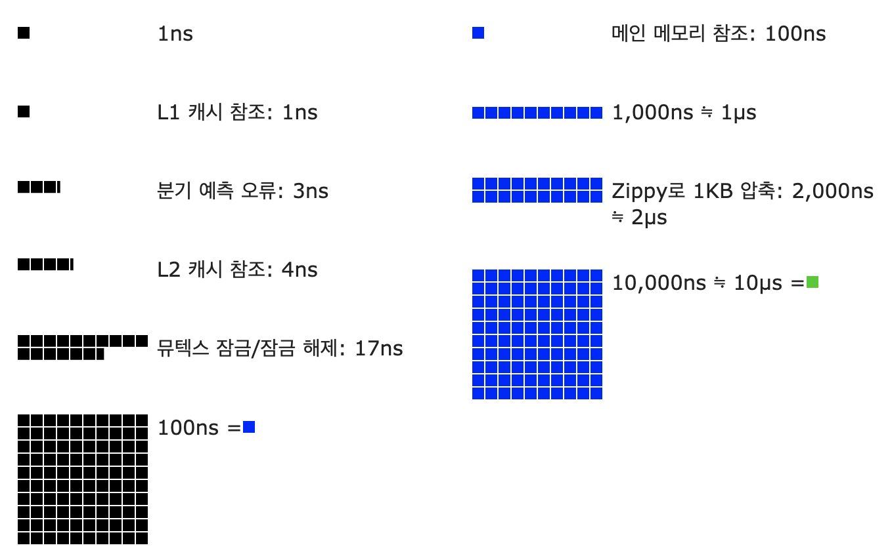

# 2장, 개략적인 규모 추정
* 시스템 용량이나 성능 요구사항을 개략적으로 추정해 보라는 요구를 받게된다. 
* > **개략적인 규모 추정**은 보편적으로 통용되는 성능 수치상에서 사고 실험을 행하여 추정치를 계산하는 행위로서,
  > 어떤 설계가 요구사항에 부합할 것인지 보기 위한것이다.
  > 
* 개략적 규모 추정을 효과적으로 해 내려면 규모 확장성을 표현하는데 필요한 2의 제곱수, 응답지연 값, 그리고 가용성에 관계된 수치들을 기본적으로 이해하고 있어야한다.

---
### 2의 제곱수
제대로 된 분산 시스템 데이터 계산 결과를 얻으려면 데이터 볼륨의 단위를 2의 제곱수로 표현하는 방법을 알아야 한다. 최소 단위는 1바이트이며, 8비트로 구성된다.  
#### 흔히 쓰이는 데이터 볼륨 단위들

---

### 모든 프로그래머가 알아야하는 응답지연 값 
구글의 제프 딘이 2010년에 「통상적인 컴퓨터에서 구현된 연산들의 응답지연값」을 공개하였다. 더 빠른 컴퓨터가 등장하면서 더 이상 유효하지 않은 값도 있지만, 여전히 컴퓨터 연산들의 처리 속도가 어느 정도인지 짐작할 수 있도록 해준다.

위의 그래프를 (2020년 기준으로) 시각화한 수치는 다음과 같다.  

수치들을 분석하면 다음과 같은 결론이 나온다.

* 메모리는 빠르지만 디스크는 아직도 느리다.
* 디스크 탐색(seek)은 가능한 한 피하라.
* 단순한 압축 알고리즘은 빠르다.
* 데이터를 인터넷으로 전송하기 전에 가능하면 압축하는 것이 좋다.
* 데이터 센터는 보통 여러 지역에 분산되어 있고, 센터들 간에 데이터를 주고받는 데는 시간이 걸린다.

---

### 가용성에 관계된 수치들
고가용성(high availability)은 시스템이 오랜 시간 동안 지속적으로 중단 없이 운영될 수 있는 능력을 지칭하는 용어다.
* 고가용성을 표현하는 값은 퍼센트(%)로 표현한다.
* 100%는 시스템이 단 한 번도 중단된 적이 없었음을 의미한다.
* 대부분의 서비스는 99%에서 100% 사이의 값을 갖는다

SLA(Service Level Agreement)는 서비스 사업자가 보편적으로 사용하는 용어로,
서비스 사업자와 고객 사이에 맺어진 합의를 의미한다.

* 이 합의에는 서비스 사업자가 제공하는 서비스의 가용시간이 공식적으로 기술되어 있다.
* 아마존, 구글, 마이크로소프트 같은 사업자는 99% 이상의 SLA를 제공한다.
* 가용시간은 관습적으로 숫자 9를 사용해 표시한다.
* 9가 많으면 많을수록 좋다고 생각하면 된다.

#### 9의 개수와 시스템 장애시간(downtime) 사이의 관계

---
#### 예제: 트위터 QPS와 저장소 요구량 추정
**가정**  
- 월간 능동 사용자는 3억명
- 50%의 사용자가 트위터를 매일 사용한다
- 평균적으로 각 사용자는 매일 2건의 트윗을 올린다.
- 미디어를 포함하는 트윗은 10% 정도
- 데이터는 5년간 보관된다.

**추정**  
QPS(Query Per Second) 추정치
- 일간 능동사용자(3억 x 50% = 1.5억)
- QPS = 1.5억 x 트윗/ 24시간 /3600초 = 약 3500
- 최대 QPS(Peek PQS) = 2 x QPS = 약 7000

**미디어 저장을위한 저장소 요구량**  
- 평균 트윗 크기
  - tweet_id에 64바이트
  - 텍스트에 140 바이트
  - 미디어에 1MB
- 미디어 저장소 요구량: 1.5억 x 2 x 10% x 1MB = 30TB /일
- 5년간 미디어를 보관하기 위한 저장소 요구량 = 30TB x 365 x 5 = 약 55 PB
