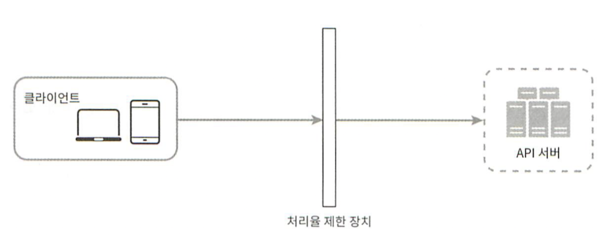
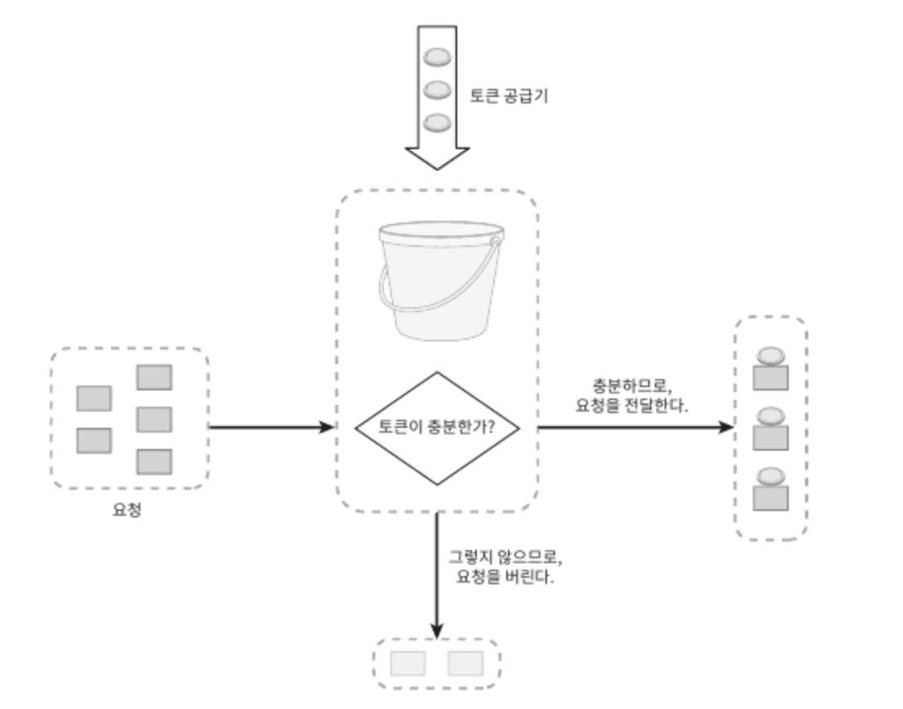
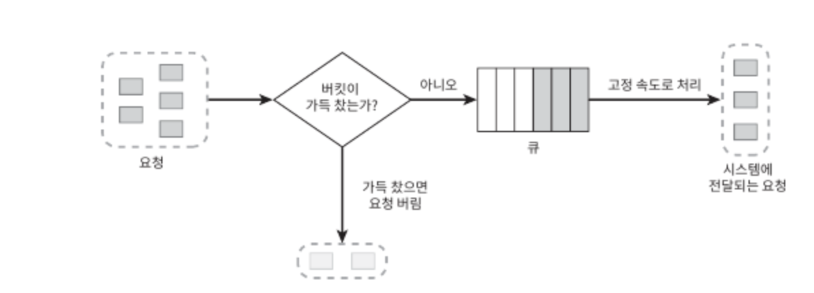
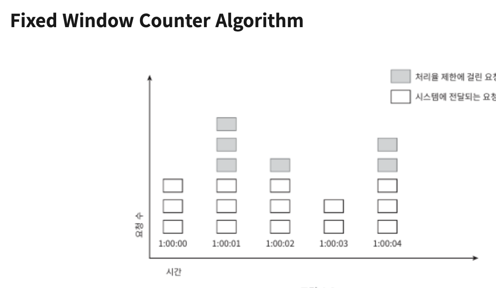
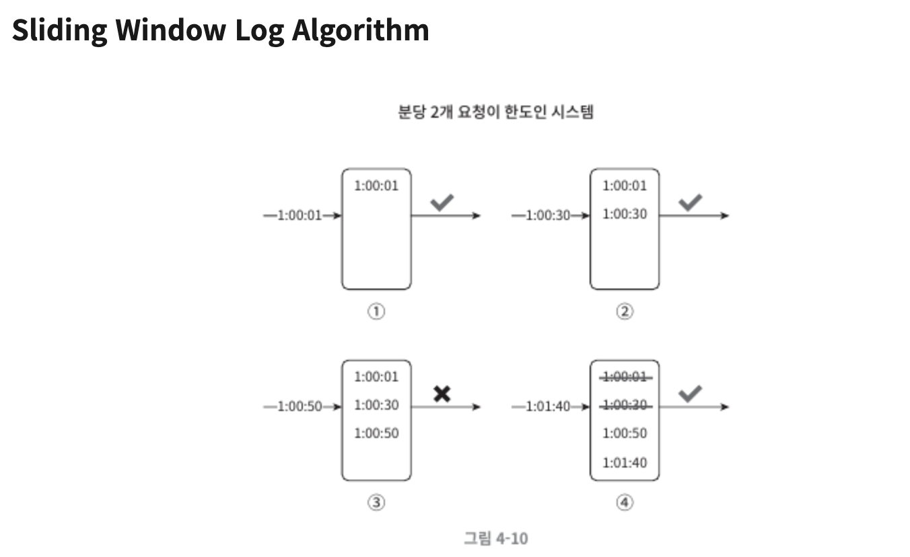
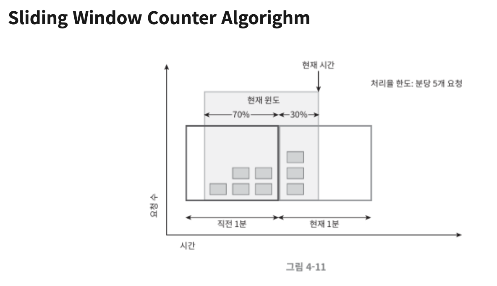
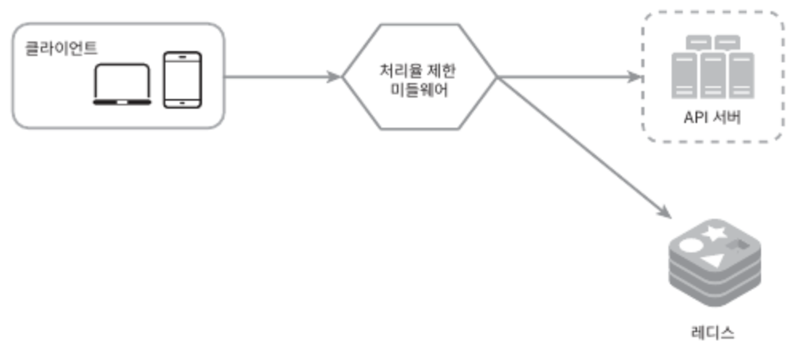
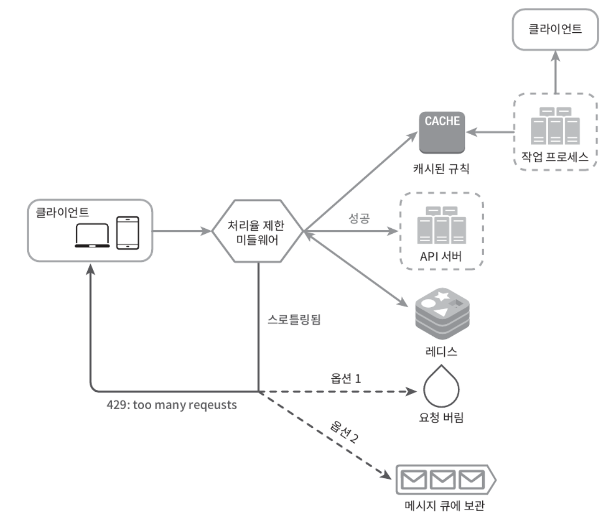

# 4장, 처리율 제한 장치의 설계
네트워크 시스템에서 처리율 제한 장치(rate limiter)는 클라이언트 또는 서비스가 보내는 트래픽의 처리율(rate)을 제어하기 위한 장치다.

설계에 앞서, API에 처리율 제한 장치를 두면 좋은 점에 대해 알아보자.

* **DoS(Denial of Service) 공격에 의한 자원 고갈(resource starvation)을 방지**할 수 있다.
  * 대형 IT기업들이 공개한 거의 대부분의 API는 어떤 형태로든 처리율 제한 장치를 가지고 있다.
  * 예를 들어 트위터는 3시간 동안 300개의 트윗만 올릴 수 있도록 제한하고 있다.
  * 처리율 제한 장치는 추가 요청에 대해서는 처리를 중단함으로써 Dos 공격을 방지한다.
* **비용을 절감한다.**
  * 추가 요청에 대한 처리를 제한하면 서버를 많이 두지 않아도 되고, 우선순위가 높은 API에 더 많은 자원을 할당할 수 있다.
  * 아울러 처리율 제한은 제3자(third-party) API에 사용료를 지불하고 있는 회사들에게는 아주 중요한다.
  * 예를 들어 신용을 확인하거나, 신용카드 결제를 하거나, 건강 상태를 확인하는 등의 작업을 위해 호출하는 API에 대한 과금이 횟수에 따라 이루어진다면, 그 횟수를 제한할 수 있어야 비용을 절감할 수 있다.
* **서버 과부하를 막는다.**
  * 봇(bot)에서 오는 트래픽이나 사용자의 잘못된 이용 패턴으로 유발된 트래픽을 걸러내는데 처리율 제한 장치를 활용할 수 있다. 그리고 시스템 구축에 필요한 정보를 모으는 것이다.  

---

### 처리율 제한 장치를 어디에 둘 것인가? 
기본적인 클라이언트-서버 통신 모델을 사용할 때,
처리율 제한 장치는 클라이언트 측에 둘 수도 있고, 서버 측에 둘 수도 있다.

> **클라이언트 측에 둔다면**  
> 클라이언트 요청은 쉽게 위변조가 가능하기 때문에 일반적으로 클라이언트는 처리율 제한을 안정적으로 걸 수 있는 장소가 못 된다. 모든 클라이언트의 구현을 통제하는 것도 어려울 수 있다.
> 

> **서버 측에 둔다면**  
> 1. 처리율 제한 장치를 API 서버에 두는 방식 
>    
> 2. 처리율 제한 미들웨어를 만들어 해당 미들웨어로 하여금 API 서버로 가는 요청을 통제하도록 하는 방식 
>   
>

폭넓게 채택된 기술인 클라우드 마이크로 서비스의 경우, 처리율 제한 장치는 보통 API게이트웨이라 불리는 컴포넌트에 구현된다.  
API게이트웨이는 처리율제한, SSL 종단, 사용자인증, IP 허용목록 관리등을 지원하는 완전 위탁관리형 서비스, 즉 클라우드 업체가 유지보수를 담당하는 서비스다.  
일단 API게이트 웨이가 처리율 제한을 지원하는 미들웨어라는 점만 기억하도록 하자.

**처리율 제한 장치의 위치**는 처리율 제한 기능을 설계할 때 중요한 요소로, 처리율 제한 장치를 무조건 서버에 혹은 무조건 클라이언트에 두는 것이 정답은 아니다. 기술 스택이나 엔지니어링 인력, 우선순위, 목표에 따라 달라질 수 있다.

다만 일반적으로 적용될 수 있는 몇 가지 지침은 다음과 같다.

* 프로그래밍 언어, 캐시 서비스 등 현재 사용하고 있는 기술 스택을 고려하라. 현재 사용하는 프로그래밍 언어가 서버 측 구현을 지원하기 충분할 정도로 효율이 높은지 확인하라.
* 사업 필요에 맞는 처리율 제한 알고리즘을 찾아라. 서버 측에서 모든 것을 구현하기로 했다면, 알고리즘은 자유롭게 선택할 수 있다. 하지만 제3 사업자가 제공하는 게이트웨이를 사용하기로 했다면 선택지는 제한될 수 있다.
* 설계가 마이크로서비스에 기반하고 있고, 사용자 인증이나 IP 허용목록 관리 등을 처리하기 위해 API 게이트웨이를 이미 설계에 포함시켰다면 처리율 제한 기능 또한 게이트웨이에 포함시켜야 할 수도 있다.
* 처리율 제한 서비스를 직접 만드는 데는 시간이 든다. 처리율 제한 장치를 구현하기에 충분한 인력이 없다면 상용 API 게이트웨이를 쓰는 것이 바람직한 방법일 것이다.

---
###  처리율 제한 알고리즘
처리율 제한 알고리즘은 여러 가지인데, 각기 다른 장단점을 가지고 있다.
널리 알려진 알고리즘으로는 다음과 같다.

* [토큰 버킷(token bucket)](#토큰-버킷--token-bucket-)
* [누출 버킷(leacky bucket)](#누출-버킷--leacky-bucket-)
* [고정 윈도 카운터(fixed window counter)](#고정-윈도-카운터--fixed-window-counter-)
* [이동 윈도 로그(sliding window log)](#이동-윈도-로그--sliding-window-log-)
* [이동 윈도 카운터(sliding window counter)](#이동-윈도-카운터--sliding-window-counter-)

#### 토큰 버킷(token bucket)
토큰 버킷 알고리즘은 처리율 제한에 폭넓게 이용되고 있다.
간단하고, 알고리즘에 대한 세간의 이해도도 높은 편이며 인터넷 기업들이 보편적으로 사용하고 있다.  

**동작 방식**  
* 토큰 버킷은 지정된 용량을 갖는 컨테이너다. 이 버킷에는 사전에 설정된 양의 토큰이 주기적으로 채워진다. 토큰이 꽉 찬 버킷에는 더 이상의 토큰은 추가되지 않는다.
* 토큰 공급기(refiller)는 이 버킷에 매초 2개의 토큰을 추가한다. 버킷이 가득 차면 추가로 공급된 토큰은 버려진다.(overflow)
* 각 요청은 처리될 때마다 하나의 토큰을 사용한다. 요청이 도착하면 버킷에 충분한 토큰이 있는지 검사하게 된다.
  * 충분한 토큰이 있는 경우, 버킷에서 토큰 하나를 꺼낸 후 요청을 시스템에 전달한다.
  * 충분한 토큰이 없는 경우, 해당 요청은 버려진다.

✅특징
* 장점
  * 구현이 쉽다.
  * 메모리 사용 측면에서도 효율적이다.
  * 짧은 시간에 집중되는 트래픽도 처리 가능하다. 버킷에 남은 토큰이 있기만 하면 요청은 시스템에 전달될 것이다.
* 단점
  * 이 알고리즘은 버킷 크기와 토큰 공급률이라는 두 개의 인자를 가지고 있는데, 이 값을 적절하게 튜닝하는 것이 까다롭다.

#### 누출 버킷(leacky bucket)

토큰 버킷 알고리즘과 비슷하지만 요청 처리율이 고정되어 있다는 점이 다르다. 누출 버킷 알고리즘은 보통 FIFO 큐로 구현한다.  

**동작 방식**
* 요청이 도착하면 큐가 가득 차 있는지 본다. 빈 자리가 있는 경우에는 큐에 요청을 추가한다.
* 큐가 가득 차 있는 경우에는 새 요청은 버린다.
* 지정된 시간마다 큐에서 요청을 꺼내어 처리한다.  

✅ 특징
* 장점
  * 큐의 크기가 제한되어 있어 메모리 사용량 측면에서 효과적이다.
  * 고정된 처리율을 가지고 있기 때문에 안정적 출력(stable outflow rate)이 필요한 경우에 적합하다.
* 단점
  * 단시간에 많은 트래픽이 몰리는 경우 큐에는 오래된 요청들이 쌓이게 되고, 그 요청들을 제때 처리하지 못하면 최신 요청들을 버려지게 된다.
  * 두 개 인자를 올바르게 튜닝하기 까다로울 수 있다.

#### 고정 윈도 카운터(fixed window counter)

**동작 방식**  
타임라인을 고정된 간격의 윈도(window)로 나누고, 각 윈도마다 카운터를 붙인다.
요청이 접수될 때마다 이 카운터의 값은 1씩 증가한다.
이 카운터의 값이 사전에 설정된 임계치(threshold)에 도달하면 새로운 요청은 새 윈도가 열릴 때까지 버려진다.  

✅ 특징
* 장점
  * 메모리 효율이 좋다.
  * 이해하기 쉽다.
  * 윈도가 닫히는 시점에 카운터를 초기화하는 방식은 특정한 트래픽 패턴을 처리하기에 적합하다.
* 단점
  * 윈도 경계 부근에서 일시적으로 많은 트래픽이 몰려드는 경우, 기대했던 시스템의 처리 한도보다 많은 양의 요청을 처리하게 된다.

#### 이동 윈도 로그(sliding window log)

이동 윈도 로깅 알고리즘은 고정 윈도 카운터의 문제점(윈도 경계 부근에 트래픽이 집중되는 경우 시스템에 설정된 한도보다 많은 요청을 처리하게 되는 것)을 해결한다.  

**동작 방식**  
이 알고리즘은 요청의 타임스탬프(timestamp)를 추적한다. 타임스탬프 데이터는 보통 레디스(Redis)의 정렬 집합 같은 캐시에 보관한다.
새 요청이 오면 만료된 타임스탬프는 제거한다. 만료된 타임스탬프는 그 값이 현재 윈도의 시작 시점보다 오래된 타임스탬프를 말한다.
새 요청의 타임스탬프를 로그(log)에 추가한다.
로그의 크기가 허용치보다 같거나 작으면 요청을 시스템에 전달한다. 그렇지 않은 경우에는 처리를 거부한다.  

✅ 특징
* 장점
  * 어느 순간의 윈도를 보더라도, 허용되는 요청의 개수는 시스템의 처리율 한도를 넘지 않는다.
* 단점
  * 거부된 요청의 타임스탬프도 보관하기 때문에 다량의 메모리를 사용한다.
#### 이동 윈도 카운터(sliding window counter)

고정 윈도 카운터 알고리즘과 이동 윈도 로깅 알고리즘을 결합한 것이다.

* 장점
  * 이전 시간대의 평균 처리율에 따라 현재 윈도의 상태를 계산하므로 짧은 시간에 몰리는 트래픽에도 잘 대응한다.
  * 메모리 효율이 좋다.
* 단점
  * 직전 시간대에 도착한 요청이 균등하게 분포되어 있다고 가정한 상태에서 추정치를 계산하기 때문에 다소 느슨하다. (심각한 문제는 아니다.)

---

### 개략적인 아키텍쳐
처리율 제한 알고리즘의 기본 아이디어는 단순하다. 얼마나 많은 요청이 접수되었는지를 추적할 수 있는 카운터를 추적 대상별로 두고, 이 카운터의 값이 어떤 한도를 넘어서면 한도를 넘어 도착한 요청을 거부하는것이다.  
* 사용자 별로 추적할 것인가?
* IP 주소 별로 추적할 것인가?
* API 엔드포인트나 서비스 단위로 추적할 것인가?
* 그렇다면이 카운터는 어디 보관할 것인가?
  * 디스크 접근 때문에 느려져 사용하면안돼서, 메모리상에서 동작하는 캐시가 바람직하다.
  * 보통 Redis는 처리율 제한 장치를 구현할 때 자주 사용되는 메모리 기반 저장장치이다
  * INCR : 메모리에 저장된 카운터의 값을 1만큼 증가시킨다.
  * EXPIRE: 카운터에 타임아웃 값을 설정한다. 설정된 시간이 지나면 카운터는 자동으로 삭제된다.

**처리율 제한 장치의 개략적 구조**  

1. 클라이언트가 처리율 제한 미들웨어에게 요청을 보낸다.
2. 처리율 제한 미들웨어는 레디스의 지정 버킷에서 카운터를 가져와서 한도에 도달했는지 아닌지 검사
   * 한도에 도달했다면 요청거부
   * 한도에 도달하지 않았다면 요청은 API서버로 전달된다. ( 미들웨어는 카운터의 값을 증가시킨 후 다시 레디스에 저장한다)

---
### 상세설계

#### 처리율 한도 초과 트래픽의 처리
어떤 요청이 한도 제한에 걸리면 API는 HTTP 429 응답을 클라이언트에게 보낸다.
경우에 따라서는 한도 제한에 걸린 메시지를 나중에 처리하기 위해 큐에 보관할 수도 있다.

#### 처리율 제한 장치가 사용되는 HTTP 헤더
* X-Ratelimit-Remaining : 
윈도 내에 남은 처리 가능 요청의 수
* X-Ratelimit-Limit : 
매 윈도마다 클라이언트가 전송할 수 있는 요청의 수
* X-Ratelimit-Retry-After : 
한도 제한에 걸리지 않으려면 몇 초 뒤에 요청을 다시 보내야 하는지 알림.

#### 상세 설계
* 처리율 제한 규칙은 디스크에 보관하고, 작업 프로세스는 수시로 규칙을 디스크에서 읽어 캐시에 저장한다.
* 클라이언트가 요청을 서버에 보내면 요청은 먼저 처리율 제한 미들웨어에 도달한다.
* 처리율 제한 미들웨어는 제한 규칙을 캐시에서 가져오고 카운터 및 마지막 요청의 타임스탬프를 레디스 캐시에서 가져온 후 다음을 결정한다.
  * 가져온 값들에 근거하여 API 서버로 보낼지 (제한에 걸리지 않는 경우)
  * 429 too many requests 에러를 클라이언트에 보낸 후 요청을 버릴지 or 메시지 큐에 보관할 지(제한에 걸릴지)

---

### 분산 환경에서의 처리율 제한 장치의 구현
단일 서버를 지원하는 처리율 제한 장치를 구현하는 것은 어렵지 않다. 하지만 여러 대의 서버와 병렬 스레드를 지원하도록 시스템을 확장하는 것은 또 다른 문제로, 다음 어려운 문제를 풀어야 한다.
경쟁 조건 (Race condition)
동기화 (Synchronization)

#### 경쟁조건
* 병행성이 심한 환경에서는 경쟁 조건 이슈가 발생할 수 있다. (Lost update)
* 경쟁 조건 문제를 해결하는 가장 널리 알려진 해결책은 Lock이다.
하지만 Lock은 시스템의 성능을 상당히 떨어트린다는 문제가 존재.
* 락 대신 쓸 수 있는 해결책으로는
  * 루아 스크립트
  * 레디스의 자료 구조인 정렬 집합 (Sorted Set)을 사용.

**동기화 이슈**  
수백만 사용자를 지원하려면 한 대의 처리율 제한 장치 서버론느 충분하지 않을 수 있다. 그래서 처리율 제한 장치 서버를 여러 대 두게 되면 동기화가 필요해진다.
클라이언트 1은 제한 장치 1에 요청을 보내고 클라이언트 2는 제한 장치 2에 요청을 보내고 있다고 가정할 때, 동기화를 하지 않는다면 제한 장치 1은 클라이언트 2에 대해 모르므로 처리율 제한을 올바르게 수행할 수 없을 것이다.

**해결책**  

Sticky Session을 통해 같은 클라이언트로부터의 요청은 항상 같은 처리율 제한 장치로 보낼 수 있도록 하는 것
규모면에서 확장 가능하지도 않고, 유연하지도 않아 추천하지 않는 방법.
레디스와 같은 중앙 집중형 데이터 저장소를 쓰는 것.