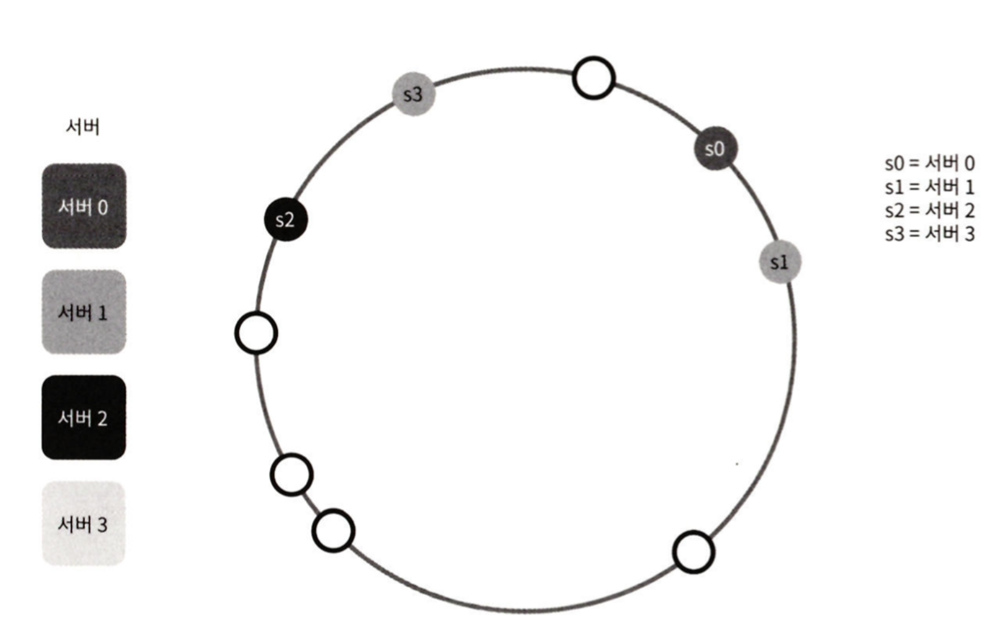

# 5장, 안정 해시 설계
수평적 규모 확장성을 달성하기 위해서는 요청 또는 데이터를 서버에 균등하게 나누는 것이 중요하다.  
안정해시는 이 목표를 달성하기 위해 보편적으로 사용하는 기술이다.

---

### 해시 키 재배치(rehash)문제
기본적인 클라이언트-서버 통신 모델을 사용할 때,
처리율 제한 장치는 클라이언트 측에 둘 수도 있고, 서버 측에 둘 수도 있다.  
N개의 캐시서버가 있다고 가정했을때, 서버들의 부하를 균등하게 나누는 보편적 방법은 아래의 **해시함수**를 사용하는것이다.

```shell
serverIndex = hash(key) % N

//N은 서버의 갯수
```
위의 방법은 서버풀의 크기가 고정되어있을때, 그리고 데이터 분포가 균등할때는 잘 동작한다.  
그러나, 서버가 추가되거나 기존 서버가 삭제되면 문제가 생긴다.

### 안정 해시
전통적인 해시 테이블은 슬롯의 수가 변경되면 거의 대부분 키를 재배치하는데,
이와는 달리 안정 해시는 해시 테이블 크기가 조정될 때 평균적으로 k(키의 개수)/n(슬롯의 개수) 개의 키만 재배치하는 해시 기술이다.

* 해시 공간의 시작과 끝을 이어 붙여 해시 링을 만든다.
* 서버 IP나 이름을 해시 링의 임의의 위치에 대응시켜 배치한다. (균등 분포 해시 함수 사용)
* 해시 키를 해시 링 위의 어느 지점에 배치한다. (균등 분포 해시 함수 사용)
* 해시 키는 시계 방향으로 링을 탐색하며 만나는 첫 번째 서버에 저장된다.
* 

만들어진 안정 해시는 서버가 추가되거나 제거돼도 해시 키를 전부 재배치하는 것이 아니라 해당 파티션의 해시 키만 재배치하므로 k/n의 키만 재배치되는 효율적인 구현을 할 수 있다.


### 기본 구현법의 두 가지 문제
1. 서버의 추가와 삭제를 감안했을 때, **파티션의 크기를 균등하게 유지하는 것이 불가능**하다는 것이다. 처음에는 균등하게 분포되었던 서버 파티션 사이에 서버가 추가되거나 삭제되면 다른 서버와의 파티션 공간에 불균등이 일어난다.
   *  
2. **해시키의 균등 분포를 달성하기 어렵다.**
   * 
   * 서버 3은 아무런 키를 갖지 않는 반면, 대부분의 키는 서버 2에 몰리게 된다.


위의 문제를 해결하기 위해 제안된 기법이 가상 노드 또는 복제라 불리는 기법이다. 
### 가상 노드
가상노드는 실제 서버를 가리키는 노드로, 하나의 서버는 링 위에 여러 개의 가상 노드를 가질 수 있다.
실제 서버를 가리키는 가상의 노드를 링위에 촘촘히 배치하면 표준편차가 작아져 키의 분포를 균등하게 유지할 수 있게 된다.
  
위 그림을 보면 서버0과, 서버1은 3개의 가상 노드를 갖는다. 
* 서버 0을 링에 배치하기 위해 s0하나만쓰는 대신, s0_0, s0_1, s0_2의 세개 가상 노드를 사용하였다. 
* 각서버는 하나가 아닌 여러개 파티션을 관리해야한다.
* 가상 노드의 개수를 늘리면 키의 분포는 점점더 균등해진다. (표준 편차가 작아져서 데이터가 분포됨)
  * 표준편차는 데이터가 어떻게 퍼져 나갔는지 보이는 척도이다. 


